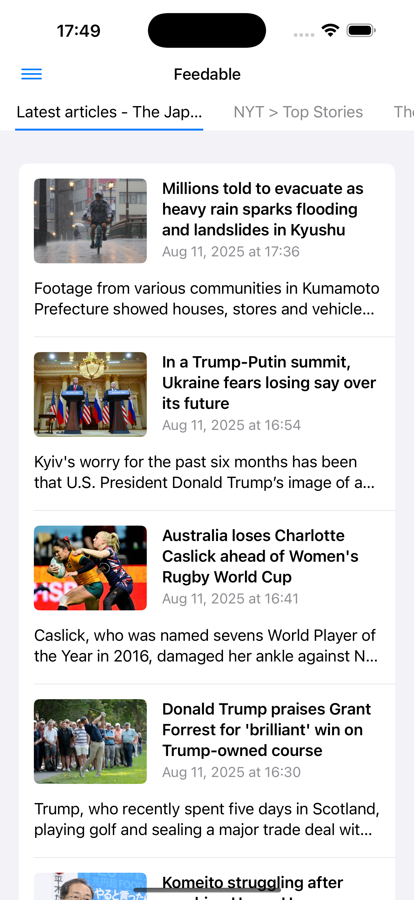
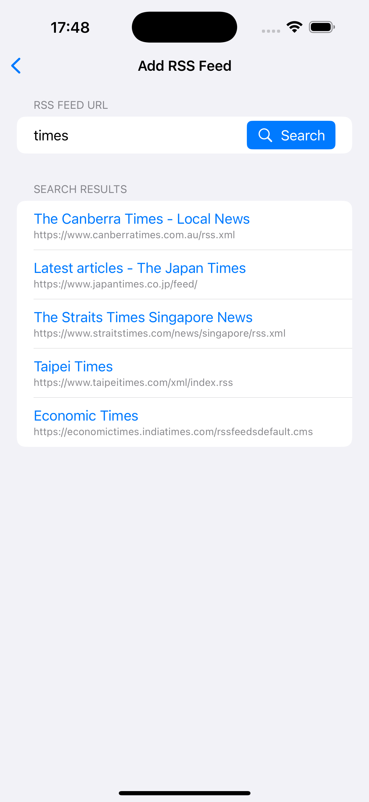

# RSS Reader – Support Page

Welcome to the support page for **RSS Reader**, the simple and lightweight app for managing and reading RSS and Atom feeds.

---

## 📱 Overview

RSS Reader lets you easily register multiple RSS or Atom feeds, browse articles in a clean interface, and switch between original and simplified viewing modes for a better reading experience.  
It is designed with performance, accessibility, and usability in mind.

---

## ✨ Main Features

- **Feed Management**

  - Register up to 30 RSS or Atom feeds
  - Add feeds by entering a URL or by searching with keywords
  - Sort, rename, or delete registered feeds

- **Feed Search**

  - Search the cloud database for feeds by keyword
  - Suggests up to 5 relevant feeds based on title matching

  

- **Article List**

  - Displays article title, publication date, description, and thumbnail
  - Automatically extracts thumbnails from content if missing in the feed
  - Swipe between different feed tabs

- **Article View**

  - **Original View** – shows the full webpage
  - **Simple View** – extracts main content for distraction-free reading
  - Simple View hides ads, sidebars, headers, and other non-essential elements

  

- **Accessibility**

  - VoiceOver support
  - Dynamic Type text resizing without UI breakage
  - High contrast color scheme (4.5:1 or higher)

- **Performance**
  - App launches in under 2 seconds
  - Smooth 60 FPS scrolling
  - Offline cache management (removes old items if exceeding 30 MB)

---

## ❓ Frequently Asked Questions (FAQ)

### How do I add a new feed?

1. Tap the **Add Feed** button on the Feed List screen.
2. Enter a valid feed URL or a keyword.
3. If entering a URL, the app will verify it’s a valid RSS/Atom feed.
4. If entering a keyword, suggestions will appear from the database.

### What is the maximum number of feeds I can add?

You can register up to **30 feeds**.

### What’s the difference between Original View and Simple View?

- **Original View** shows the exact webpage as published.
- **Simple View** extracts only the main article content for easier reading.

### Can I read articles offline?

Yes. Articles are cached for offline reading, but old items may be deleted if the cache exceeds **30 MB**.

### Does the app support multiple languages?

Yes. The app supports **English** (default) and **Japanese**.  
The language will automatically match your device settings.

---

## 📩 Contact Support

If you encounter issues or have feature requests, please contact us:

- **Email:** support@example.com
- **Website:** [https://example.com/rssreader-support](https://example.com/rssreader-support)

---

## 📜 Privacy Policy

This app uses Firebase Firestore to store feed data (URL, title, last fetch time).  
No personal information or authentication is required to write to the database.  
Only valid feeds are stored, and duplicate feeds are not recorded.
